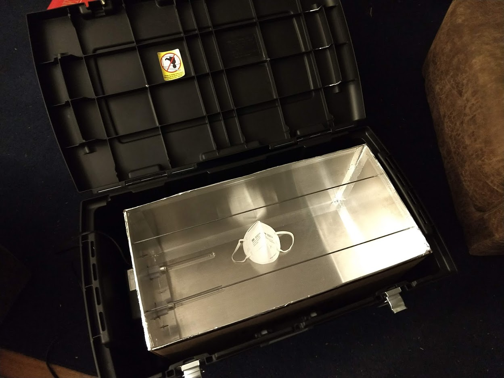
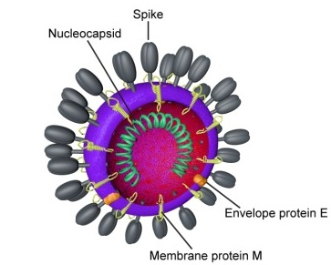
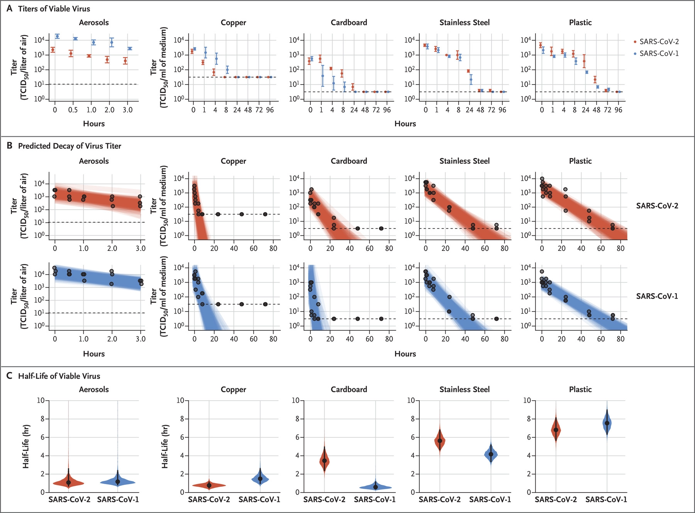
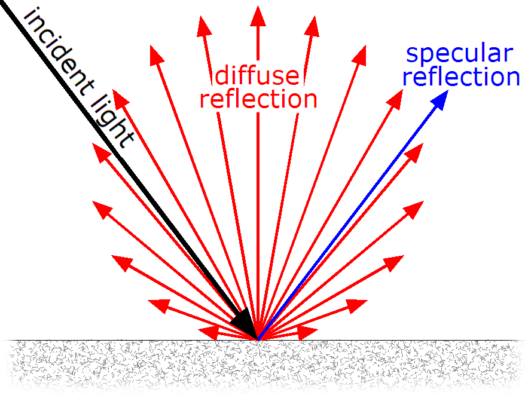
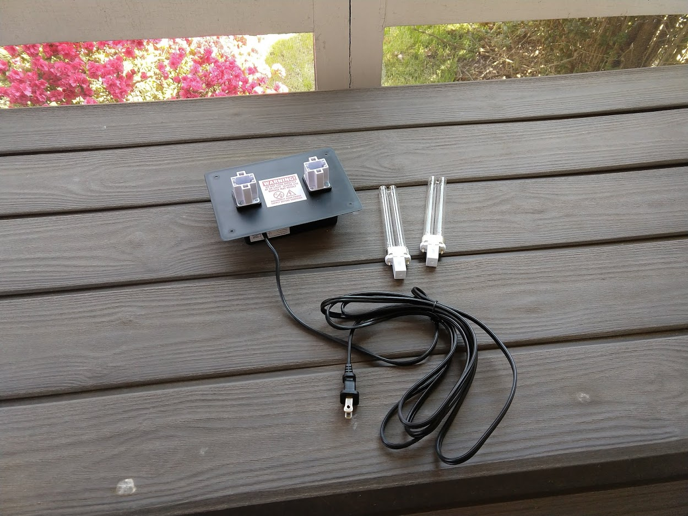

# UVCBox

## A Local Solution to N95 Filtering Facepiece Respirator (FFR) Decontamination

  

---

## Table of Contents

[Introduction](#introduction)

[What are N95 respirators?](#what-are-n95-respirators)

[What is Ultraviolet Light?](#what-is-ultraviolet-light)

[What is the Coronavirus?](#what-is-the-coronavirus)

[Protection and Decontamination](#protection-and-decontamination)

[Decontaminating N95 Respirators](#decontaminating-n95-respirators)

[The UVC Box](#the-uvc-box)

[Conclusion](#conclusion)

[References](#references)

---

## Introduction

Due to the COVID-19 pandemic, demand for personal protective equipment (PPE) has quickly outpaced supply. Unfortunately, it appears that high demand for PPE, such as N95-rated respirators, will continue into the summer months, and there are no practical alternatives to these items. In addition, large health care systems quickly collect PPE supply as it appears, reducing the PPE available for smaller systems, such as local fire departments, health care clinics, etc.

For these local systems, we ask if we can extend our PPE through decontamination. Specifically, we ask: Can we extend the working life of N-95 respirators through decontamination with UVC light?

> **NOTE** - Even though we have restricted all citations and references in this paper to articles contained in scientific journals or government publications, the COVID-19 pandemic is an ongoing event, and information presented pertaining to the virus, respirators, decontamination, etc., may quickly change. 

---

## What are N95 respirators?

A N95 filtering facepiece respirator (FFR) is a tight-fitting respirator that provides the user with respiratory protection against hazardous dust, fumes, and mists. Its design must be evaluated, tested, and approved by the National Institute for Occupational Safety and Health (NIOSH). The respirator is to be used in workplaces free of oil aerosols, and, as stated in its name, the respirator must filter out 95% of particulates 0.3 microns in size or larger, including aerosols in concentration of 200 mg/m3 (Approval of Respiratory Protective Devices, 2004). It uses several layers of randomly interwoven fibers and an electrostatic charge to capture particles before they are inhaled by the user. The respirator provides more protection as it accumulates particles, albeit at the cost of breathing efficiency. The respirator, however, does not neutralize contaminants, whether chemical, biological, or radiological.

 image of meltblown microfiber fabric")

***Figure 1. Scanning electron microscopy (SEM) image of meltblown microfiber fabric (Credit: Stanford University and 4C Air, Inc.)***

---

## What is Ultraviolet Light?

UV light is an electromagnetic radiation of photons, moving in wavelengths between 10 nanometers (nm) and 400 nm:

***Table 1: Types of Electromagnetic Radiation***
|Common Term	              |Wavelength                |
|---------------------------|--------------------------|
|Gamma Radiation            |Up to 0.001 nm            |
|X-Rays	                    |0.01 to 10 nm             |
|UV Light                   |10 - 400 nm               |
|Visible Light              |400 - 700 nm              |
|Infrared Light             |700 - 1,000,000 nm or 1 mm|
|Microwaves                 |1 mm to 1 m               |
|UHF, FM, and AM Radio Waves|1 m to 100 m              |

While ISO-21348 identifies nine (9) sub-types of UV light, the forms of UV light that can be easily replicated on Earth are UVA, UVB, and UVC. The Sun naturally emits these types of UV radiation; the Earth's ozone layer absorbs almost all UVC rays and most UVB rays. UVA light is not blocked and is visible at longer wavelengths (in the form of "black lights") when radiation of visible light is low or absent. The effect of UV light are as follows:

-	Acute exposure to UVA causes pigmentation (i.e., tanning) and chronic exposure causes wrinkles by breaking down collagen fibers in the dermis in humans.

-	Acute exposure to UVB causes tanning at a more rapid rate, but can also cause sunburn, and chronic exposure can cause skin cancer by damaging the ribonucleic acid (RNA) of skin cells of humans (Wurtmann & Wolin, 2009).

-	Acute exposure to UVC results in rapid onset of all the acute and chronic effects of UVA and UVB radiation, as well as damage to the RNA of other types of cells, in all organisms, including viruses (Wurtmann & Wolin, 2009).

---

## What is the Coronavirus?

The infectious disease known as COVID-19 is caused by the Severe Acute Respiratory Syndrome-Related Coronavirus (SARS-CoV-2), a single-stranded RNA virus protected by a lipid bilayer envelope.

***Figure 2. Diagram of coronavirus virion structure (Credit: Sandrine Belouzard and NIH)***

SARS-CoV-2 infects the cells of the lungs of mammals, including humans, and, when it replicates, it damages or destroys those cells. This action can cause excessive fluid build-up, resulting in shortness of breath, and possibly pneumonia. SARS-CoV-2 can also trigger a hyperactive immune response, causing inflammation and destruction of healthy tissue. Both actions can cause severe respiratory distress and death (Sims, et al., 2005).

The diameter of the SARS-CoV-2 virus ranges from 80 to 140 nm (0.08 to 0.14 microns). However, it appears that the virus is not a true airborne virus (such as the similarly enveloped, single-stranded-RNA measles morbillivirus) and is transmitted primarily via respiratory droplets greater than 0.5 microns in size (Rabi, et al., 2020).

While the primary means of infection is inhalation of contaminated aerosols, SARS-CoV-2 can last several days on surfaces as well (Van Doremalen, et al., 2020). From there, the virus can be transmitted by touch to the face and mouth, which may eventually enter the lungs.

***Figure 3. Viability of SARS-CoV-1 and SARS-CoV-2 in aerosols and on various surfaces (Credit: New England Journal of Medicine)***

---

## Protection and Decontamination

Isolation and reducing contact with others (i.e., Social Distancing) are the most effective means of protection from the virus (CDC, 2020a). However, in situations where close interactions cannot be avoided, as with first responders, health care providers, and patients, the Centers for Disease Control and Prevention (CDC) recommend N95 respirators, eye protection, gloves, and gowns. The CDC has also published a set of recommendations for infection prevention and control in health care settings (CDC, 2020b).

Regarding decontamination, SARS-CoV-2 may be eliminated in many ways. Simply using soap and water destroys the virus' protective envelope, causing its proteins to fall apart. Decontaminants, such as isopropyl alcohol, bleach, and hydrogen peroxide, also destroy the virus' envelope within 1 minute (EPA, 2020). Moist heat, at temperatures greater than 60 degrees C (140 degrees F) at 80% relative humidity, can also be used for decontamination (CDC, 2020c).

---

## Decontaminating N95 Respirators

However, except for moist heat, the above methods cannot be used to decontaminate N95 respirators. In addition, under normal circumstances, the Food and Drug Administration (FDA), NIOSH, and the CDC do not recommend reusing the N95 respirator (CDC, 2020c). However, the CDC recognizes the extraordinary situation caused by the COVID-19 pandemic and has published the following guidance (CDC, 2020c):

>**Reuse of N95 Respirators:**

>*"One strategy to mitigate the contact transfer of pathogens from the FFR to the wearer during reuse is to issue five respirators to each healthcare worker who may care for patients with suspected or confirmed COVID-19. The healthcare worker will wear one respirator each day and store it in a breathable paper bag at the end of each shift. The order of FFR use should be repeated with a minimum of five days between each FFR use."*

>**Decontamination of N95 Respirators:**

>*"CDC and NIOSH do not recommend that FFRs be decontaminated and then reused as standard care. This practice would be inconsistent with their approved use, but we understand in times of crisis, this option may need to be considered when FFR shortages exist."*

In the same guidance, the CDC states that "Vaporous hydrogen peroxide, ultraviolet germicidal irradiation, and moist heat are the most promising FFR decontamination methods," since these methods do not break down the structure of the respirators or affect their efficiency (CDC, 2020c).

There are few large-scale respirators decontamination systems appearing during this pandemic. For example, the Battelle Critical Care Decontamination System (CCDS) has been approved by the FDA and is "funded by the Defense Logistics Agency (DLA) on behalf of the Department of Health and Human Services (HHS) and the Federal Emergency Management Agency (FEMA) to provide N95 decontamination at no charge" to health care personnel (Battelle, 2020). Health care personnel, including first responders, collect used respirators and ship them to one of Battelle's three facilities. Battelle then decontaminates the respirators using vaporous hydrogen peroxide and ships them back to the health care facility, preferably in as little as 72 hours once operations reach full capability (Battelle, 2020).

Other examples include fumigation using hydrogen peroxide by the Duke University Hospitals and UVC decontamination by the University of Nebraska Medical Center (Mackenzie, 2020). As stated before, the CDC recognizes ultraviolet germicidal irradiation as a viable means to decontaminate N95 respirators. Further research states that SARS-CoV-2's single-stranded RNA is very susceptible to UVC, and that exposing the virus to UVC, at wavelengths between 200-280 nm, for 60 minutes, resulted in virus inactivation of over 99.9% without damage to the respirator (Darnell & Taylor, 2006; Tseng & Li, 2007; Liao, et al., 2020).

---

## The UVC Box

As stated before, decontamination of N95 respirators is not recommended. However, if necessary, the Battelle CCDS appears to be the most promising solution, if it operates as expected and the clients have enough respirators to cover three or more days of operations. As a backup, we propose another means of decontamination that can be reconstructed using locally sourced items: the UVC Box.

***Figure 4. UVC Box (Credit: Own work)***

The box is 24" long, 12" in both width and height, with two hanging rods, and is lined with mill-finished aluminum. Except for the UV light module, we procured all the materials to construct the box through local stores, and the light module can be recreated locally as well:

***Table 2: UVC Box Parts List***
|Item                                             |UI Price|Qty|Total Price|
|-------------------------------------------------|--------|---|-----------|
|Box, cardboard, 24" x 12" x 12"                  |   $3.75|  1|      $3.75|
|Sheet, Aluminum, 12" x 12"                       |   $7.47|  2|     $14.94|
|Sheet, Aluminum, 24" x 12"                       |   $9.88|  4|     $39.52|
|Rod, Aluminum, 1/8" x 10'                        |   $2.78|  2|      $5.56|
|In-Duct HVAC Air Purifier, Dual Bulb, UVC, 120V  |  $67.50|  1|     $67.50|
|Tape, Foil, Aluminum, 1.88" x 10 yards           |   $3.99|  1|      $3.99|
|Tape, Duct & Multiuse, 1.88" x 10 yards          |   $5.97|  1|      $5.97|
|Drywall Corner Bead, Stainless Steel, 1.25" x 10'|   $2.87|  1|      $2.87|
|Switch, Overtravel, 125V                         |  $12.26|  1|     $12.26|
|                                                 |        |   |    $156.36|

We purchased the UVC light assembly to expedite the build; however, there are less expensive alternatives. In addition, we placed the box within a Sterilite Footlocker for additional protection during transport; this is not needed for static locations.

To line the box, we chose aluminum over other metals for its excellent UV reflectivity, which multiplies the effects of UV light through irradiance and extends the range of UV radiation (ASHRAE, 2015):

, silver (Ag), and gold (Au) metal mirrors at normal incidence")

***Figure 4. Reflectance vs. wavelength curves for aluminum (Al), silver (Ag), and gold (Au) metal mirrors at normal incidence (Credit Bob Mellish)***

We chose not to coat the aluminum surface with glass or other materials, in order to prevent absorption (ASHRAE, 2015). We also did not polish the aluminum surface; diffuse reflection may allow UV energy to reach areas of the N95 respirators that are not directly opposite the angle of incidence. However, polished aluminum increases irradiance, and we recognize we must do further research on the pros and cons of aluminum finishes:

***Figure 6. Diffuse and specular reflection from a glossy surface (Credit G. Gianni)***

The UVC light is provided by two 8000 hour, 9-watt bulbs, requiring 60 volts each. Each bulb emits 2.4 watts of UVC light per square meter at a wavelength of 253.7 nm.

***Figure 7. UVC lamp system (Credit: Own work)***

At two feet, one bulb will provide 559.2 microwatts per square centimeter (µW/cm²) (Keitz, 1971; ASHRAE, 2015):

***Table 3: UVC Wattage by Distance (1 W/m² = 100 µW/cm²)***
|Distance (inches)|Intensity Factor|Microwatts per square centimeter (µW/cm²)|
|-----------------|----------------|-----------------------------------------|
|6|12.9|3096.0|
|12|6.48|1555.2|
|24|2.33|559.2|
|39.37 (1 m)|1.0|240.0|

Two bulbs applying 559.2 µW/cm² over one hour is greater than 4 Joules per square centimeter (J/cm²) at the farthest point in the box, which is eight times the minimum dosage recommended by the CDC to decontaminate respirators (CDC, 2020c). In addition, this dosage is greater than the dosage used to inactivate SARS-CoV-2 in several studies (Darnell & Taylor, 2006; Tseng & Li, 2007; Liao, et al., 2020). 

Please note that these numbers do not account for the irradiance multiplier due to the box's aluminum lining, nor does it account for penalties due to shadowing, etc., so placement of the masks within the box is important. If necessary and if time allows, users can rearrange the masks and run a second decontamination session. However, while the respirators have been decontaminated up to 10 times in research (Mackenzie, 2020), we recommend limiting decontamination to three full cycles.

Once the UV decontamination is complete, we recommend applying heated air from the inside of the mask outward, using a device such as a non-ionic hair dryer. This action not only cleans out particles caught by the mask but may also reapply the mask's electrostatic charge (Liao, et al., 2020; Mackenzie, 2020).

Please note that it is important to note that UVC decontamination efficiency drops when the virus is combined with a serum, such as blood albumin (Darnell & Taylor, 2006). Therefore, discard any respirators exposed to bodily fluids or are marked with makeup. In addition, discard any respirators that are compromised (e.g., frayed, etc.) in any way.

---

## Conclusion

The UVC Box is an easily reproduced and low-cost solution to extending the supply of N95 respirators through decontamination. It can act alone or in conjunction with a mask rotation system, as suggested by the CDC. In addition, it requires no chemicals or solutions and produces no runoff or byproducts. If the situation arises where the local supply of N95 respirators cannot meet demand, the UVC Box can be used to stabilize supply until additional respirators can be procured.

---

## References

- Approval of Respiratory Protective Devices, 42 CFR Part 84.170 (2004) https://www.govinfo.gov/content/pkg/CFR-2004-title42-vol1/xml/CFR-2004-title42-vol1-part84.xml
- ASHRAE. (2015). 60. Ultraviolet air and surface treatment. In ASHRAE handbook. Atlanta, GA.
- Battelle Memorial Institute. (2020). Battelle CCDS critical care decontamination system for PPE decontamination. Retrieved from https://www.battelle.org/inb/battelle-critical-care-decontamination-system-for-covid19
- Centers for Disease Control and Prevention. (2020a, April 13). Social distancing, quarantine, and isolation (COVID-19). Retrieved from https://www.cdc.gov/coronavirus/2019-ncov/prevent-getting-sick/social-distancing.html
- Centers for Disease Control and Prevention. (2020b, April 15). Infection control recommendations (COVID-19). Retrieved from https://www.cdc.gov/coronavirus/2019-ncov/hcp/infection-control-recommendations.html
- Centers for Disease Control and Prevention. (2020c, April 13). Decontamination and reuse of filtering face-piece respirators (COVID-19). Retrieved from https://www.cdc.gov/coronavirus/2019-ncov/hcp/ppe-strategy/decontamination-reuse-respirators.html
- Darnell, M. E. R., & Taylor, D. R. (2006). Evaluation of inactivation methods for severe acute respiratory syndrome coronavirus in noncellular blood products. Transfusion, 46(10), 1770–1777. [doi:10.1111/j.1537-2995.2006.00976.x](https://doi.org/10.1111/j.1537-2995.2006.00976.x)
- International Organization for Standardization. (2007). Space environment (natural and artificial) (ISO/DIS Standard No. 21348).
- Keitz, H. A. (1971). Light calculations and measurements: An introduction to the system of quantities and units in light-technology and to photometry. Retrieved from [doi:10.1007/978-1-349-00012-8](https://doi.org/10.1007/978-1-349-00012-8)
- Liao, L., Xiao, W., Zhao, M., Yu, X., Wang, H., Wang, Q., … Cui, Y. (2020). Can N95 respirators be reused after disinfection? And for how many times? [doi:10.1101/2020.04.01.20050443](https://doi.org/10.1101/2020.04.01.20050443)
- Mackenzie, D. (2020). Reuse of N95 respirators. Engineering. [doi:10.1016/j.eng.2020.04.003](https://doi.org/10.1016/j.eng.2020.04.003)
- Rabi, F. A., Al Zoubi, M. S., Kasasbeh, G. A., Salameh, D. M., & Al-Nasser, A. D. (2020). SARS-CoV-2 and Coronavirus Disease 2019: What We Know So Far. Pathogens, 9(3), 231. [doi:10.1016/j.eng.2020.04.003](https://doi.org/10.3390/pathogens9030231)
- Sims, A. C., Baric, R. S., Yount, B., Burkett, S. E., Collins, P. L., & Pickles, R. J. (2005). Severe acute respiratory syndrome coronavirus infection of human ciliated airway epithelia: role of ciliated cells in viral spread in the conducting airways of the lungs. Journal of Virology, 79(24), 15511–15524. [doi:10.1128/jvi.79.24.15511-15524.2005](https://doi.org/10.1128/jvi.79.24.15511-15524.2005)
- Tseng, C.-C., & Li, C.-S. (2007). Inactivation of viruses on surfaces by ultraviolet germicidal irradiation. Journal of Occupational and Environmental Hygiene, 4(6), 400–405. [doi:10.1080/15459620701329012](https://doi.org/10.1080/15459620701329012)
- US Environmental Protection Agency. (2020, April 13). List N: Disinfectants for use against SARS-Cov-2. Retrieved from https://www.epa.gov/pesticide-registration/list-n-disinfectants-use-against-sars-cov-2
- Van Doremalen, N., Bushmaker, T., Morris, D. H., Holbrook, M. G., Gamble, A., Williamson, B. N., ... Munster, V. J. (2020). Aerosol and surface stability of SARS-CoV-2 as compared with SARS-CoV-1. New England Journal of Medicine, 382(16), 1564–1567. [doi:10.1056/nejmc2004973](https://doi.org/10.1056/nejmc2004973)
- Wurtmann, E. J., & Wolin, S. L. (2009). RNA under attack: Cellular handling of RNA damage. Critical Reviews in Biochemistry and Molecular Biology, 44(1), 34–49. [doi:10.1080/10409230802594043](https://doi.org/10.1080/10409230802594043)
